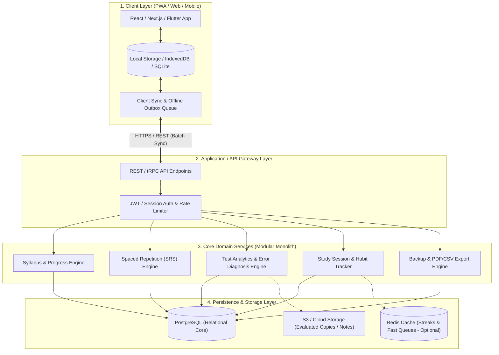
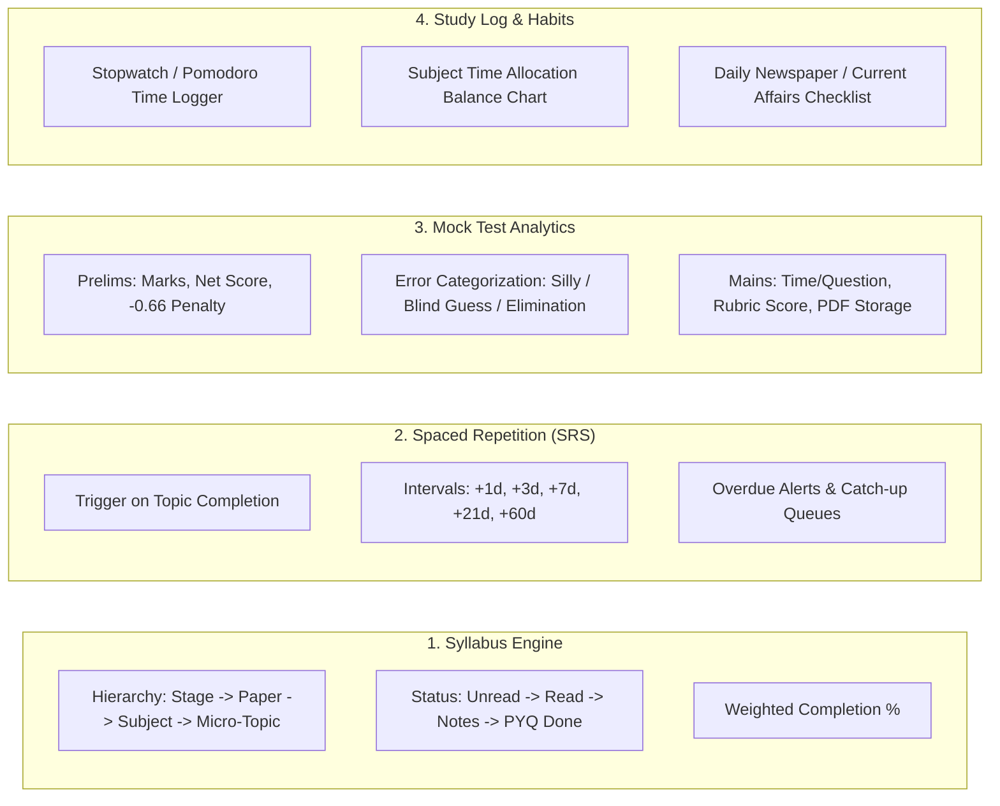
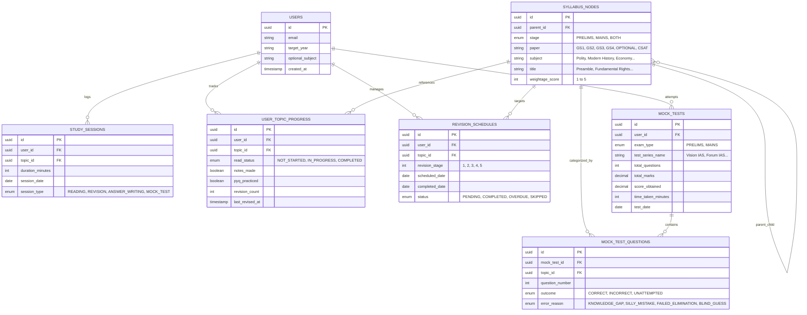
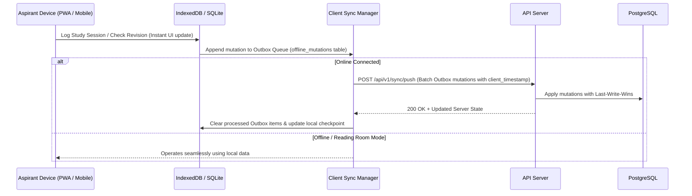

# 🎯 UPSC Aspirant Exam Tracker — System Architecture & Design Specification

A comprehensive, production-grade architectural blueprint for a dedicated **UPSC Civil Services Examination (CSE) Tracker**. Designed specifically around the realities of UPSC preparation: a ~750 micro-topic syllabus hierarchy, multi-round spaced repetition revision cycles, Prelims negative marking error diagnostics, Mains answer-writing time tracking, and offline-first study hall usability.

> 🚀 **Quick Links:**
> - 📄 **[Technical Implementation Plan](TECHNICAL_PLAN.md)**: Full architecture, modules to include, IndexedDB schemas, and execution roadmap.
> - 🏛️ **[Official Exam Roadmap & Specs](exam-tracker.md)**: Official syllabus, 10-year PYQ weightage, and All-India Mock Rank engine.
> - 🧮 **[UPSC Prelims Rank & Score Calculator](calculator.html)**: Interactive negative-marking & error autopsy calculator.

---

## 📌 Table of Contents
1. [Domain Analysis & Problem Statement](#-domain-analysis--problem-statement)
2. [High-Level System Architecture](#-high-level-system-architecture)
3. [Core Functional Modules](#-core-functional-modules)
4. [Database Schema Design (PostgreSQL)](#-database-schema-design-postgresql)
5. [Core Algorithmic Workflows](#-core-algorithmic-workflows)
6. [Offline-First & Data Sync Strategy](#-offline-first--data-sync-strategy)
7. [API Specifications](#-api-specifications)
8. [Recommended Technology Stack](#-recommended-technology-stack)
9. [Architectural Trade-Offs](#-architectural-trade-offs)

---

## 🧠 Domain Analysis & Problem Statement

UPSC CSE preparation spans 12–24 months with unique characteristics that generic task managers or habit trackers cannot handle:

1. **Vast, Multi-Tiered Syllabus**:
   - **3 Distinct Stages**: Prelims (GS Paper I + CSAT qualifying), Mains (9 descriptive papers: Essay, GS I–IV, Optional I & II, Compulsory Language & English), and Personality Test (Interview).
   - **Granular Micro-Topics**: Over 750 individual micro-topics (e.g., *GS-3 $\rightarrow$ Agriculture $\rightarrow$ Public Distribution System $\rightarrow$ Buffer Stock Management*).
2. **The "Forgetting Curve" Trap**:
   - Aspirants read standard references (*Laxmikanth, Spectrum, Ramesh Singh, Shankar IAS/PMF IAS*) but fail to retain facts unless revised at strictly spaced intervals (+1d, +3d, +7d, +21d, +60d).
3. **Prelims Negative Marking Reality**:
   - Aspirants don't fail Prelims because of lack of knowledge; they fail due to avoidable penalties (-0.667 marks per wrong answer). The system must diagnose *why* a mistake occurred (e.g., *Silly Mistake* vs *Knowledge Gap* vs *Failed 50-50 Elimination* vs *Wild Guess*).
4. **Mains Answer Writing Speed & Structure**:
   - Strict time limits (7 minutes for a 10-marker, 11 minutes for a 15-marker). The tracker must record timing, rubric evaluation scores, and link evaluated answer PDFs.
5. **Study Environments**:
   - Aspirants frequently study in reading rooms or libraries with poor connectivity or in airplane mode. The application must be **100% offline-capable**.

---

## 🏗 High-Level System Architecture

The system utilizes a **Modular Monolith** pattern paired with an **Offline-First Client**. This provides sub-millisecond local latency, zero microservice network overhead, and rock-solid relational data integrity.



---

## 🧩 Core Functional Modules



### 1. Hierarchical Syllabus & Micro-Topic Engine
* Pre-seeded with the official UPSC syllabus down to granular micro-topics (~750 topics).
* Multi-stage progress tracking per topic:
  * `read_status`: `NOT_STARTED` $\rightarrow$ `IN_PROGRESS` $\rightarrow$ `COMPLETED`
  * `notes_status`: `NONE` $\rightarrow$ `HANDWRITTEN` $\rightarrow$ `DIGITAL` $\rightarrow$ `SUMMARY_SHEET`
  * `pyq_status`: `NOT_ATTEMPTED` $\rightarrow$ `PRELIMS_PYQ_DONE` $\rightarrow$ `MAINS_PYQ_WRITTEN`
* **Weighted Progress Calculation**: High-yield areas (e.g., *Modern History, Polity, Environment*) reflect higher weightage in overall readiness metrics than low-frequency topics.

### 2. Spaced Repetition Revision (SRS) Engine
* Automates the spaced revision cycle. Once an aspirant marks a topic as `Completed` or `Revised`:
  * **Revision 1**: +1 Day
  * **Revision 2**: +3 Days
  * **Revision 3**: +7 Days
  * **Revision 4**: +21 Days
  * **Revision 5**: +60 Days
* **Overdue Backlog System**: Highlights skipped/delayed revisions and surfaces them in a dedicated daily review deck before new topics are started.

### 3. Mock Test & PYQ Diagnostic Engine
* **Prelims Mocks**:
  * Calculates gross marks, negative deductions, net score, and percentile benchmark.
  * **Error Taxonomy**: Every wrong answer must be tagged with a root-cause:
    1. *Knowledge Gap* (unaware of the factual/conceptual basis)
    2. *Silly Mistake / Misread* (overlooked "not correct", wrong bubble mark)
    3. *Failed 50-50 Elimination* (narrowed down to 2 options, picked wrong)
    4. *Over-attempt / Blind Guess*
* **Mains Mocks**:
  * Logs question counts, time taken per question (in seconds), self/evaluator score, and stores annotated answer PDFs.

### 4. Daily Study Log, Time Allocation & Current Affairs
* Tracks daily study hours vs weekly target (e.g., 8–10 hours/day).
* **Subject Time Balance Chart**: Warns against over-indexing on favourite subjects (e.g., spending 70% time on Polity while neglecting Ethics, CSAT, or Essay).
* **Daily Current Affairs Checklist**: Daily toggle for *The Hindu / Indian Express*, *PIB*, and monthly current affairs compilations.

---

## 🗄 Database Schema Design (PostgreSQL)



---

## ⚙️ Core Algorithmic Workflows

### 1. Spaced Repetition Scheduling Algorithm
```text
When User marks Topic T as "Completed" or "Revised":
1. Fetch current revision_count for Topic T (default 0).
2. Set next_stage = revision_count + 1.
3. Determine interval based on next_stage:
     Stage 1 -> +1 day
     Stage 2 -> +3 days
     Stage 3 -> +7 days
     Stage 4 -> +21 days
     Stage 5 -> +60 days
     Stage >5 -> +90 days
4. scheduled_date = current_date + interval.
5. Create record in REVISION_SCHEDULES with status = 'PENDING'.
6. Update USER_TOPIC_PROGRESS:
     revision_count = next_stage,
     last_revised_at = current_timestamp.
```

### 2. Prelims Mock Diagnostic & Score Computation
```text
Input: List of 100 questions with [outcome, error_reason, topic_id]

Calculation:
- total_attempted = count(outcome in [CORRECT, INCORRECT])
- correct_count = count(outcome == CORRECT)
- incorrect_count = count(outcome == INCORRECT)
- positive_marks = correct_count * 2.0
- negative_marks = incorrect_count * 0.667
- net_score = positive_marks - negative_marks
- accuracy = (correct_count / total_attempted) * 100

Error Loss Analysis:
- silly_loss = count(error_reason == SILLY_MISTAKE) * 2.667
  (2 positive marks missed + 0.667 negative penalty)
- potential_score = net_score + silly_loss

Weak Subject Flagging:
- Group incorrect answers by Syllabus Topic
- Flag topics where (incorrect / attempted) > 0.40 as "Immediate Revision Required"
```

---

## 📶 Offline-First & Data Sync Strategy

Aspirants study in low-reception libraries or airplane mode. The application uses an **Optimistic Offline-First** model:



* **Local Cache**: Local database (IndexedDB on Web, SQLite on Mobile) holds the full syllabus and all user progress locally.
* **Mutation Outbox**: Offline changes are stored with UUIDs, timestamps, and action types (`UPSERT`/`DELETE`).
* **Conflict Resolution**: Deterministic **Last-Write-Wins (LWW)** using timestamps, ensuring zero data loss during sync reconnections.

---

## 🔌 API Specifications

| Endpoint | Method | Purpose | Key Parameters / Payload |
| :--- | :--- | :--- | :--- |
| `/api/v1/syllabus/tree` | `GET` | Retrieve complete syllabus tree & user progress | `?stage=PRELIMS&subject=Polity` |
| `/api/v1/syllabus/:id/status` | `PATCH` | Update reading, notes, or PYQ completion | `{ "read_status": "COMPLETED", "notes_made": true }` |
| `/api/v1/revisions/due` | `GET` | Fetch list of revisions due today or overdue | `?date=2026-09-09` |
| `/api/v1/revisions/:id/complete` | `POST` | Mark revision done & trigger next SRS interval | `{ "notes": "Revised Fundamental Rights articles" }` |
| `/api/v1/mocks/prelims` | `POST` | Record a complete Prelims mock attempt | `{ "test_series": "Vision IAS Test 1", "questions": [...] }` |
| `/api/v1/mocks/analytics` | `GET` | Get error diagnostic breakdown & weak topic list | `?timeframe=last_30_days` |
| `/api/v1/sessions/log` | `POST` | Record daily study hours / Pomodoro session | `{ "topic_id": "...", "duration_minutes": 120, "type": "READING" }` |
| `/api/v1/analytics/dashboard` | `GET` | Overview metrics (Hours, Syllabus %, Overdue, Streaks) | Returns composite dashboard summary |
| `/api/v1/export/backup` | `GET` | Download full user ledger in JSON/CSV | Complete export guaranteeing user data ownership |

---

## 💻 Recommended Technology Stack

| Layer | Recommended Choice | Rationale |
| :--- | :--- | :--- |
| **Frontend UI** | **Next.js (React PWA)** or **Flutter** | Full offline support, responsive mobile & desktop web, rapid form interactions. |
| **Local DB** | **IndexedDB (Dexie.js)** or **SQLite** | High performance local storage for offline state persistence. |
| **Backend API** | **Node.js (TypeScript/Fastify)** or **Python (FastAPI)** | Modular monolith, lightweight, type-safe API contracts, fast response times. |
| **Database** | **PostgreSQL** | Relational integrity for tree structures (`WITH RECURSIVE`), strong indexing for query speeds. |
| **Object Store** | **AWS S3 / Cloudflare R2** | Inexpensive, durable storage for evaluated Mains answer sheets & PDF copies. |
| **Auth** | **JWT / Supabase Auth / NextAuth** | Simple, stateless authentication supporting multi-device synchronization. |

---

## ⚖️ Architectural Trade-Offs

1. **Modular Monolith vs Microservices**:
   * *Decision*: Modular Monolith.
   * *Rationale*: Avoids distributed network latency and operational complexity for a solo or small-team project, while preserving strict logical separation between modules.
2. **Fixed Interval SRS vs Full Anki SM-2**:
   * *Decision*: Fixed Staged Interval Matrix (+1d, +3d, +7d, +21d, +60d).
   * *Rationale*: UPSC preparation revolves around revising chapters and book sections, not isolated flashcards. Fixed milestone intervals match book-based revision cycles.
3. **Data Ownership & Export**:
   * *Decision*: One-click full JSON/CSV export.
   * *Rationale*: Aspirants spend years preparing; guaranteeing uninhibited export of their study data builds trust and eliminates platform lock-in anxiety.
