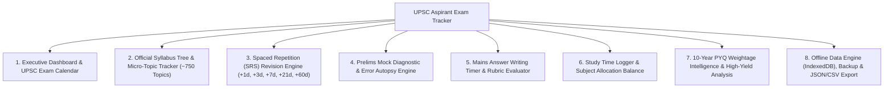
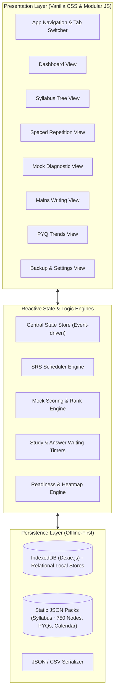
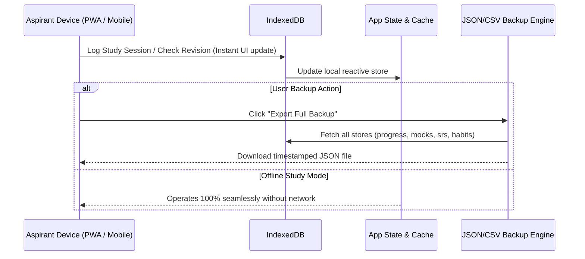

# 📚 UPSC Aspirant Exam Tracker — Technical Plan & Architecture Specification

A production-grade technical plan and design specification for building the **UPSC Civil Services Examination (CSE) Tracker**. Designed specifically around the multi-year realities of UPSC CSE preparation: an official ~750 micro-topic syllabus hierarchy, multi-round spaced repetition (SRS) revision cycles, Prelims negative marking error autopsy, Mains answer-writing timers with evaluation rubrics, study habit analytics, and 100% offline-first reading room usability.

---

## 📌 Table of Contents
1. [Core Modules to Include](#-core-modules-to-include)
2. [High-Level System Architecture](#-high-level-system-architecture)
3. [Technology Selection & Rationale](#-technology-selection--rationale)
4. [Database & Data Model Specifications (IndexedDB)](#-database--data-model-specifications-indexeddb)
5. [Core Algorithmic Workflows](#-core-algorithmic-workflows)
6. [Offline-First & Data Portability Strategy](#-offline-first--data-portability-strategy)
7. [Phased Implementation Roadmap](#-phased-implementation-roadmap)
8. [Verification & Quality Assurance Plan](#-verification--quality-assurance-plan)

---

## 🧩 Core Modules to Include

The software is structured into **8 core functional modules** tailored specifically to the multi-year UPSC preparation lifecycle:



### 1. Executive Dashboard & Official UPSC Calendar
- **Live Countdown Timers**:
  - Days/hours remaining until Civil Services Preliminary Exam.
  - Notification release and OTR (One Time Registration) closing countdown (strictly 06:00 PM deadline).
  - Mains 5-day examination schedule and Forenoon/Afternoon shift clocks (09:00 AM & 02:00 PM entry cutoffs).
- **Daily At-a-Glance Metrics**:
  - Daily study hours logged vs 8-10 hour daily target.
  - Overall weighted syllabus completion percentage.
  - Number of revisions due today (SRS queue).
  - Latest mock test net score, All-India simulated percentile, and cutoff safety rating.
- **Daily Current Affairs Checklist**:
  - One-click tracker for *The Hindu / Indian Express* editorial reading, *PIB (Press Information Bureau)* summary, and monthly magazine compilation.

### 2. Hierarchical Syllabus & Micro-Topic Tracker (~750 Topics)
- Pre-seeded with official verbatim syllabus from `upsc.gov.in`:
  - **Prelims**: GS Paper-I (History, Polity, Economy, Geography, Environment, Sci-Tech, Current Affairs) & CSAT Paper-II.
  - **Mains**: Essay, GS-I, GS-II, GS-III, GS-IV (Ethics with Case Studies), Optional Papers 1 & 2, and Compulsory Languages (Paper A & B).
- **Multi-Stage Topic Progression**:
  - `Read Status`: Not Started $\rightarrow$ In Progress $\rightarrow$ Completed.
  - `Notes Status`: None $\rightarrow$ Handwritten $\rightarrow$ Digital $\rightarrow$ One-Page Summary Sheet.
  - `PYQ Status`: Not Attempted $\rightarrow$ Prelims PYQ Solved $\rightarrow$ Mains PYQ Written.
- **10-Year PYQ Frequency Badges**: Topics flagged with **High-Yield** (Economy, Polity, Environment), **Medium**, or **Foundational** priority.
- **Search & Filter Matrix**: Instant filtering by paper, subject, completion status, notes status, and priority.

### 3. Spaced Repetition Revision (SRS) Engine
- Solves the Ebbinghaus forgetting curve across 12–24 months of preparation.
- **Fixed Staged Interval Algorithm**:
  - Revision 1: **+1 Day** after topic completion.
  - Revision 2: **+3 Days** after Revision 1.
  - Revision 3: **+7 Days** after Revision 2.
  - Revision 4: **+21 Days** after Revision 3.
  - Revision 5: **+60 Days** after Revision 4 (Mastery stage).
- **Daily Revision Deck (Due Queue)**:
  - 🔴 **Overdue Deck**: Revisions delayed past scheduled date (highlighted with alert banner).
  - 🟡 **Due Today**: Scheduled for today's study session.
  - 🔵 **Upcoming Deck**: Preview of next 7 days' revision load.
- One-click completion with revision duration and quick review notes.

### 4. Prelims Mock Diagnostic & Error Autopsy Engine
- Standardized exam-grade score calculation:
  - Correct answers: $+2.00$ marks.
  - Incorrect penalty: $-0.667$ marks.
  - Unattempted: $0.00$ marks.
  - Accuracy Rate: $\frac{\text{Correct}}{\text{Attempted}} \times 100\%$.
- **Error Autopsy Taxonomy**: Every wrong question is tagged to diagnose root causes:
  1. **Knowledge Gap** (unaware of the factual/conceptual basis).
  2. **Silly Mistake / Misread** (missed "NOT correct", incorrect OMR bubbling).
  3. **Failed 50-50 Elimination** (narrowed to 2 options, picked wrong).
  4. **Blind Guess / Over-attempt** (impulsive guessing on low-probability questions).
- **Silly Mistake Mark Drain**: Quantifies exactly how many marks were forfeited to avoidable mistakes (each silly error costs $2.00 + 0.667 = 2.667$ marks).
- **Simulated All-India Rank (AIR) & Percentile**:
  - Calibrated against a ~500,000 peer cohort distribution.
  - Benchmarked against historical UPSC cutoffs (2019–2023) with safety zones (🔴 Red Zone $<75$, 🟡 Amber Zone $75-88$, 🟢 Green Zone $88-105$, 💎 Diamond League $>105$).
- **Weak Subject / Topic Heatmap**: Auto-flags syllabus topics where error rate exceeds $40\%$.

### 5. Mains Answer Writing & Speed Practice Tracker
- **Integrated Speed Timers**:
  - 10-Marker Practice: Strict 7-minute countdown (150 words).
  - 15-Marker Practice: Strict 11-minute countdown (250 words).
  - Essay Paper Practice: 3-hour timer with midway outline alert.
- **Qualitative Rubric Checklist**:
  - Introduction (Context / Definition / Recent event).
  - Body Dimension Spread (PESTLE: Political, Economic, Social, Technological, Legal, Environmental).
  - Value Additions (Diagram, Flowchart, Map, Case Study, Supreme Court Judgment, Committee Name).
  - Balanced Conclusion / Way Forward (SDG alignment or Constitutional philosophy).
- Logging of marks awarded, evaluator feedback notes, and self-review tags.

### 6. Study Time Logger & Subject Allocation Balance
- **Integrated Pomodoro & Stopwatch**:
  - Study with topic association (e.g. 50 min deep work on *Polity: Parliament*).
- **Subject Time Balance Radar**:
  - Visual distribution of study hours across subjects.
  - Alerts if user is over-indexing on favourite subjects (e.g., spending $60\%$ of time on Modern History while neglecting Ethics, CSAT, or Agriculture).
- **Daily Study Streak Counter**:
  - Encourages consistent 8–10 hour study days without burnout.

### 7. 10-Year PYQ Weightage Intelligence & Analytics
- Embedded archive of 2013–2025 question distributions across all Prelims and Mains papers.
- Visual breakdown of the **High-Yield Trio**:
  - Economy ($\sim 18\%$), Environment ($\sim 16\%$), Polity ($\sim 15\%$) comprise over $49\%$ of Prelims GS-1.
- Subject-by-subject trends for Mains GS 1 to 4 to guide preparation priority.

### 8. Offline Storage, Data Privacy & Portability
- **Zero-Login Required Option**: All data stored locally in the browser via IndexedDB with unlimited capacity.
- **Full Data Ownership**:
  - One-click JSON backup (complete state export).
  - One-click JSON restore.
  - CSV export of mock test history, syllabus progress, and revision logs for spreadsheet analysis.
- **PWA Capabilities**: Installable on Windows, macOS, Android, and iOS for standalone windowed operation without browser chrome.

---

## 🏗 High-Level System Architecture



---

## 💻 Technology Selection & Rationale

| Layer | Technology | Rationale |
| :--- | :--- | :--- |
| **Structure & Logic** | HTML5 + Modern Vanilla JavaScript (ES Modules) | Zero build friction, ultra-lightweight, instant loading, no framework churn, 100% portable. |
| **Styling** | Vanilla CSS3 (Custom Properties, Flexbox/Grid, Glassmorphism) | Tailored HSL color palette, rich dark mode, hardware-accelerated micro-animations, no bloated runtime dependencies. |
| **Typography** | Google Fonts (`Outfit` + `Plus Jakarta Sans`) | Modern, crisp legibility designed for dense hierarchical data and long reading hours. |
| **Local Database** | IndexedDB (`js/db.js`) | Fast indexed queries, large storage limit (gigabytes), transaction safety for offline syllabus tracking. |
| **Charts & Graphs** | HTML5 Canvas / SVG Micro-Charts | Lightweight, dependency-free rendering of percentiles, distribution curves, and subject balance radars. |
| **Offline Distribution** | PWA Manifest + Service Worker | Offline asset caching, desktop & mobile installation. |

---

## 🗄 Database & Data Model Specifications (IndexedDB)

### Store 1: `syllabus_nodes` (Pre-seeded ~750 topics)
```typescript
interface SyllabusNode {
  id: string;             // e.g. "prelims-polity-preamble"
  stage: "PRELIMS" | "MAINS" | "BOTH";
  paper: "GS1" | "GS2" | "GS3" | "GS4" | "ESSAY" | "OPTIONAL" | "CSAT";
  subject: string;        // e.g. "Indian Polity & Governance"
  subtopic: string;       // e.g. "Constitutional Framework"
  title: string;          // e.g. "Preamble: Objectives, Amendability & Key Cases"
  weightage: 1 | 2 | 3 | 4 | 5; // 5 = High-yield (Economy/Polity/Env)
  pyq_count: number;      // 10-year question appearance count
}
```

### Store 2: `topic_progress`
```typescript
interface TopicProgress {
  topicId: string;        // FK -> syllabus_nodes.id
  readStatus: "NOT_STARTED" | "IN_PROGRESS" | "COMPLETED";
  notesStatus: "NONE" | "HANDWRITTEN" | "DIGITAL" | "SUMMARY_SHEET";
  pyqStatus: "NOT_ATTEMPTED" | "PRELIMS_SOLVED" | "MAINS_WRITTEN" | "BOTH_DONE";
  revisionCount: number;  // 0, 1, 2, 3, 4, 5
  lastStudiedAt: string;  // ISO timestamp
}
```

### Store 3: `revision_schedules` (SRS Queue)
```typescript
interface RevisionSchedule {
  id: string;             // UUID
  topicId: string;        // FK -> syllabus_nodes.id
  stage: number;          // 1 (+1d), 2 (+3d), 3 (+7d), 4 (+21d), 5 (+60d)
  scheduledDate: string;  // YYYY-MM-DD
  completedDate?: string; // YYYY-MM-DD
  status: "PENDING" | "COMPLETED" | "OVERDUE" | "SKIPPED";
  revisionNotes?: string;
}
```

### Store 4: `mock_tests` (Prelims & Mains attempts)
```typescript
interface MockTest {
  id: string;             // UUID
  testName: string;       // e.g. "Vision IAS Full Length 1"
  examStage: "PRELIMS" | "MAINS";
  paperType: "GS" | "CSAT" | "ESSAY" | "OPTIONAL";
  testDate: string;       // YYYY-MM-DD
  totalQuestions: number;
  correctCount: number;
  incorrectCount: number;
  unattemptedCount: number;
  grossScore: number;
  negativeDeduction: number;
  netScore: number;
  accuracyRate: number;
  sillyMistakeCount: number;
  marksLostSilly: number;
  simulatedAir: number;
  percentile: number;
  safetyZone: "RED" | "AMBER" | "GREEN" | "DIAMOND";
  errorBreakdown: {
    knowledgeGap: number;
    sillyMistake: number;
    failedElimination: number;
    blindGuess: number;
  };
}
```

### Store 5: `study_sessions` (Time & Habits)
```typescript
interface StudySession {
  id: string;
  topicId?: string;
  subject: string;
  durationMinutes: number;
  sessionDate: string;    // YYYY-MM-DD
  sessionType: "READING" | "REVISION" | "ANSWER_WRITING" | "MOCK_TEST" | "NEWSPAPER";
  notes?: string;
}
```

---

## ⚙️ Core Algorithmic Workflows

### 1. Spaced Repetition Scheduling Algorithm
```text
When User marks Topic T as "Completed" or "Revised":
1. Fetch current revisionCount for Topic T (default 0).
2. Set nextStage = revisionCount + 1.
3. Determine interval based on nextStage:
     Stage 1 -> +1 day
     Stage 2 -> +3 days
     Stage 3 -> +7 days
     Stage 4 -> +21 days
     Stage 5 -> +60 days
     Stage >5 -> +90 days
4. scheduledDate = currentDate + interval.
5. Create record in revision_schedules with status = 'PENDING'.
6. Update topic_progress:
     revisionCount = nextStage,
     lastStudiedAt = currentTimestamp.
```

### 2. Prelims Mock Diagnostic & Score Computation
```text
Input: List of 100 questions with [outcome, error_reason, topic_id]

Calculation:
- total_attempted = count(outcome in [CORRECT, INCORRECT])
- correct_count = count(outcome == CORRECT)
- incorrect_count = count(outcome == INCORRECT)
- positive_marks = correct_count * 2.0
- negative_marks = incorrect_count * 0.667
- net_score = positive_marks - negative_marks
- accuracy = (correct_count / total_attempted) * 100

Error Loss Analysis:
- silly_loss = count(error_reason == SILLY_MISTAKE) * 2.667
  (2 positive marks missed + 0.667 negative penalty)
- potential_score = net_score + silly_loss

Weak Subject Flagging:
- Group incorrect answers by Syllabus Topic
- Flag topics where (incorrect / attempted) > 0.40 as "Immediate Revision Required"
```

---

## 📶 Offline-First & Data Portability Strategy



---

## 🗓️ Phased Implementation Roadmap

- **Phase 1: Foundation & Data Architecture**: Pre-seed official UPSC syllabus micro-topics (`syllabus-prelims.json`, `syllabus-mains.json`), 10-year weightage (`pyq-weightage.json`), and exam calendar (`exam-calendar.json`). Set up `js/db.js` IndexedDB engine.
- **Phase 2: Design System & Application Shell**: Curated dark theme, HSL palette, glassmorphism, responsive navigation sidebar/tabs in `index.html` and `css/style.css`.
- **Phase 3: Executive Dashboard & Countdown Clocks**: Prelims & Mains countdowns, shift timings, study hours tracker, and daily newspaper/current affairs checklist.
- **Phase 4: Hierarchical Syllabus & Micro-Topic Engine**: Multi-tiered accordion, read/notes/PYQ switches, search filter, and weighted progress bars.
- **Phase 5: Spaced Repetition (SRS) Revision Engine**: Automated forgetting-curve intervals, overdue alerts, due today queue, and one-click completion.
- **Phase 6: Mock Test Diagnostic & Rank Engine**: Standardized scoring (+2.0 / -0.667), error taxonomy autopsy, mark drain calculator, simulated AIR/percentile curve, and historical cutoffs.
- **Phase 7: Mains Answer Writing & Speed Practice**: 7-minute (10-marker) and 11-minute (15-marker) timers, rubric checklist (PESTLE, diagrams, case laws), and answer evaluation log.
- **Phase 8: Data Portability, PWA & Final Polish**: JSON backup/restore, CSV exports, PWA manifest, and offline service worker.

---

## ✅ Verification & Quality Assurance Plan

1. **Offline Integrity Verification**: Disconnect network in browser DevTools and confirm dashboard, syllabus tree, mock calculator, and revision queue function with zero network requests.
2. **Syllabus & SRS Verification**: Mark a micro-topic as "Completed" $\rightarrow$ Verify that a +1 day revision entry is automatically generated in the SRS schedule.
3. **Mock Scoring & Error Autopsy Verification**: Test mock entry with 10 incorrect answers tagged with 3 "Silly Mistakes" $\rightarrow$ Confirm gross score, negative penalty, net score, and silly mistake mark drain ($3 \times 2.667 = 8.00$ marks) display accurately.
4. **Mains Stopwatch Verification**: Run 7-minute 10-marker timer $\rightarrow$ Test pause, resume, and completion chime.
5. **Data Backup & Restore Verification**: Export JSON $\rightarrow$ Clear data $\rightarrow$ Import JSON $\rightarrow$ Verify all state is restored identically.
