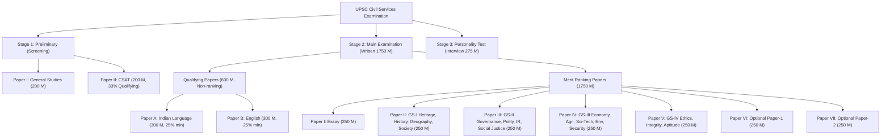

# 📚 UPSC Aspirant Exam Tracker — Complete Product Specification & Roadmap

A comprehensive, production-grade guide detailing the core feature set, official UPSC examination timelines, official syllabus structure from `upsc.gov.in`, 10-year Previous Year Question (PYQ) weightage breakdown, and the All-India Mock Rank & Percentile engine.

---

## 📅 1. Official UPSC Exam Timelines, Registration & Exam-Day Schedule

To keep aspirants organized and eliminate deadline panic, the tracker integrates the official UPSC examination schedule and shift timetable.

### A. Key Registration & Application Milestones
* **Notification Release Date**: Typically **February** (e.g., mid-February).
* **OTR (One Time Registration) & Online Application Window**: Open for 21 days from notification.
* **Application Deadline**: Strictly **06:00 PM** on the final registration day.
* **Correction Window**: 7-day window opened immediately after registration closes for modifying photograph, signature, and exam center choices.
* **e-Admit Card Release**: Typically released **2 to 3 weeks** before the Preliminary exam on [upsconline.nic.in](https://upsconline.nic.in).

---

### B. Exam Day Timetable & Shift Timings

#### 1. Civil Services (Preliminary) Examination (1 Day — Sunday)
* Strict entry rule: Examination hall gates close **30 minutes prior** to session commencement (09:00 AM and 02:00 PM).

| Paper | Subject | Exam Timing | Duration | Total Marks | Nature |
| :--- | :--- | :--- | :--- | :--- | :--- |
| **Paper-I** | **General Studies (GS)** | **09:30 AM – 11:30 AM** | 2 Hours | 200 (100 Questions) | Merit ranking for Mains qualification |
| *Break* | *Rest & CSAT formula review* | *11:30 AM – 02:00 PM* | 2.5 Hours | — | Light meal & mental reset |
| **Paper-II** | **Civil Services Aptitude Test (CSAT)** | **02:30 PM – 04:30 PM** | 2 Hours | 200 (80 Questions) | **Qualifying only** (Min 33% = 66.67 marks) |

#### 2. Civil Services (Main) Examination (5 Days — 9 Descriptive Papers)
* **Forenoon Session**: **09:00 AM – 12:00 PM** (3 Hours)
* **Afternoon Session**: **02:00 PM – 05:00 PM** (3 Hours)

| Day | Forenoon Session (09:00 AM – 12:00 PM) | Afternoon Session (02:00 PM – 05:00 PM) |
| :--- | :--- | :--- |
| **Day 1 (Friday)** | **Paper-I: Essay** (250 Marks) | *No session (Self-prep)* |
| **Day 2 (Saturday)** | **Paper-II: General Studies-I** (250 Marks) | **Paper-III: General Studies-II** (250 Marks) |
| **Day 3 (Sunday)** | **Paper-IV: General Studies-III** (250 Marks) | **Paper-V: General Studies-IV (Ethics)** (250 Marks) |
| *5-Day Gap* | *Optional & Language Revision* | *Optional & Language Revision* |
| **Day 4 (Saturday)** | **Paper-A: Indian Language** (300 Marks - Qualifying) | **Paper-B: English** (300 Marks - Qualifying) |
| **Day 5 (Sunday)** | **Paper-VI: Optional Subject Paper-1** (250 Marks) | **Paper-VII: Optional Subject Paper-2** (250 Marks) |

---

## 🏛️ 2. Official UPSC Syllabus Structure (Direct from upsc.gov.in)

The software embeds the exact verbatim syllabus declared in the official UPSC CSE notification.

### A. Preliminary Examination Syllabus
* **Paper I — (200 marks) Duration: Two hours**:
  1. Current events of national and international importance.
  2. History of India and Indian National Movement.
  3. Indian and World Geography - Physical, Social, Economic Geography of India and the World.
  4. Indian Polity and Governance - Constitution, Political System, Panchayati Raj, Public Policy, Rights Issues, etc.
  5. Economic and Social Development - Sustainable Development, Poverty, Inclusion, Demographics, Social Sector Initiatives, etc.
  6. General issues on Environmental Ecology, Bio-diversity and Climate Change - that do not require subject specialization.
  7. General Science.

* **Paper II — (200 marks) Duration: Two hours (CSAT)**:
  1. Comprehension.
  2. Interpersonal skills including communication skills.
  3. Logical reasoning and analytical ability.
  4. Decision making and problem solving.
  5. General mental ability.
  6. Basic numeracy (numbers and their relations, orders of magnitude, etc.) (Class X level).
  7. Data interpretation (charts, graphs, tables, data sufficiency etc. - Class X level).

---

### B. Main Examination Syllabus (Merit Ranking)
* **Paper-I: Essay (250 Marks)**: Candidates are required to write essays on multiple topics (Section A & B: Philosophical, Economic, Geopolitical, Social).
* **Paper-II: General Studies-I (250 Marks)**:
  - Indian culture, art forms, literature, architecture from ancient to modern times.
  - Modern Indian history from about the middle of the eighteenth century until the present- significant events, personalities, issues.
  - The Freedom Struggle — its various stages and important contributors/contributions.
  - Post-independence consolidation and reorganization within the country.
  - History of the world: Industrial revolution, world wars, redrawal of national boundaries, colonisation, decolonisation, political philosophies like communism, capitalism, socialism.
  - Salient features of Indian Society, Diversity of India, Role of women, Population, Poverty, Urbanization, Globalization, Social empowerment, Communalism, Regionalism, Secularism.
  - Salient features of world's physical geography, distribution of key natural resources, factors responsible for the location of primary, secondary, and tertiary sector industries.
  - Important Geophysical phenomena: earthquakes, Tsunami, Volcanic activity, cyclones, geographical features, flora & fauna.
* **Paper-III: General Studies-II (250 Marks)**:
  - Indian Constitution—historical underpinnings, evolution, features, amendments, significant provisions and basic structure.
  - Functions and responsibilities of the Union and the States, issues and challenges pertaining to federal structure, devolution of powers and finances up to local levels.
  - Separation of powers between various organs, dispute redressal mechanisms and institutions.
  - Comparison of the Indian constitutional scheme with that of other countries.
  - Parliament and State legislatures—structure, functioning, conduct of business, powers & privileges.
  - Executive and Judiciary, ministries/departments, pressure groups and formal/informal associations.
  - Salient features of the Representation of People’s Act.
  - Appointment to various Constitutional posts, powers, functions and responsibilities.
  - Statutory, regulatory and various quasi-judicial bodies.
  - Government policies and interventions for development in various sectors.
  - Development processes and the development industry — the role of NGOs, SHGs, donors, charities.
  - Welfare schemes for vulnerable sections by the Centre and States.
  - Issues relating to development and management of Social Sector/Services: Health, Education, Human Resources.
  - Issues relating to poverty and hunger.
  - Important aspects of governance, transparency and accountability, e-governance, citizens charters.
  - Role of civil services in a democracy.
  - India and its neighbourhood- relations; Bilateral, regional and global groupings; Effect of policies of developed/developing countries; Important International institutions.
* **Paper-IV: General Studies-III (250 Marks)**:
  - Indian Economy and issues relating to planning, mobilization of resources, growth, development and employment.
  - Inclusive growth and issues arising from it; Government Budgeting.
  - Major crops, cropping patterns, irrigation, storage, transport and marketing of agricultural produce; e-technology in the aid of farmers.
  - Issues related to direct and indirect farm subsidies and minimum support prices; Public Distribution System (PDS) objectives, functioning, limitations, revamping; buffer stocks and food security; economics of animal-rearing.
  - Food processing and related industries in India.
  - Land reforms in India.
  - Effects of liberalization on the economy, changes in industrial policy and their effects on industrial growth.
  - Infrastructure: Energy, Ports, Roads, Airports, Railways etc.; Investment models.
  - Science and Technology- developments and their applications and effects in everyday life.
  - Achievements of Indians in science & technology; indigenization of technology.
  - Awareness in IT, Space, Computers, robotics, nano-technology, bio-technology and issues relating to intellectual property rights.
  - Conservation, environmental pollution and degradation, environmental impact assessment.
  - Disaster and disaster management.
  - Linkages between development and spread of extremism.
  - Role of external state and non-state actors in creating challenges to internal security.
  - Challenges to internal security through communication networks, role of media and social networking sites; cyber security basics; money-laundering and its prevention.
  - Security challenges and their management in border areas; linkages of organized crime with terrorism.
  - Various Security forces and agencies and their mandate.
* **Paper-V: General Studies-IV (250 Marks - Ethics, Integrity & Aptitude)**:
  - Ethics and Human Interface: Essence, determinants and consequences of Ethics in-human actions; dimensions of ethics; ethics - in private and public relationships.
  - Human Values - lessons from the lives and teachings of great leaders, reformers and administrators; role of family, society and educational institutions in inculcating values.
  - Attitude: content, structure, function; its influence and relation with thought and behaviour; moral and political attitudes; social influence and persuasion.
  - Aptitude and foundational values for Civil Service: integrity, impartiality and non-partisanship, objectivity, dedication to public service, empathy, tolerance and compassion.
  - Emotional intelligence-concepts, and their utilities and application in administration and governance.
  - Contributions of moral thinkers and philosophers from India and world.
  - Public/Civil service values and Ethics in Public administration.
  - Probity in Governance: Concept of public service; Philosophical basis of governance and probity; Information sharing and transparency in government, Right to Information, Codes of Ethics, Codes of Conduct, Citizen’s Charters, Work culture, Quality of service delivery, Utilization of public funds, challenges of corruption.
  - **Case Studies** on above issues (comprising 120–130 marks of the 250 marks paper).

---

## 📊 3. 10-Year Previous Year Questions (PYQ) & Subject Weightage Trends

The tracker embeds an archive of official UPSC PYQs (2013–2025) categorized down to micro-topics with statistical weightage analysis.

### A. Prelims 10-Year Subject Weightage Trend (Questions out of 100)

| Subject Area | 2019 | 2020 | 2021 | 2022 | 2023 | 2024 | 2025 (Est) | 10-Yr Avg | Weightage % |
| :--- | :---: | :---: | :---: | :---: | :---: | :---: | :---: | :---: | :---: |
| **Polity & Governance** | 15 | 17 | 18 | 10 | 15 | 16 | 15 | **15.2** | **15.2%** |
| **Economy & Agriculture** | 21 | 23 | 14 | 18 | 14 | 18 | 17 | **18.1** | **18.1%** |
| **Environment & Ecology** | 17 | 15 | 15 | 16 | 14 | 15 | 16 | **15.8** | **15.8%** |
| **Modern Indian History** | 6 | 8 | 8 | 6 | 4 | 7 | 6 | **7.1** | **7.1%** |
| **Ancient, Medieval & Culture** | 9 | 10 | 12 | 10 | 9 | 8 | 9 | **9.8** | **9.8%** |
| **Geography & Mapping** | 14 | 10 | 12 | 12 | 16 | 13 | 14 | **12.6** | **12.6%** |
| **Science & Technology** | 10 | 10 | 11 | 14 | 10 | 11 | 11 | **11.2** | **11.2%** |
| **Current Affairs & IR** | 8 | 7 | 10 | 14 | 18 | 12 | 12 | **10.2** | **10.2%** |
| **Total Questions** | **100** | **100** | **100** | **100** | **100** | **100** | **100** | **100** | **100%** |

> [!TIP]
> **The High-Yield "Trio" Insight**: Economy, Environment, and Polity alone constitute **~49% to 52% of the entire Prelims paper**. Master these three to clear the cutoff safely!

---

### B. Mains 10-Year Subject Mark Distribution (Out of 250 Marks per Paper)

* **GS Paper-I (250 Marks)**:
  - World & Indian Geography: ~100–110 Marks (40–44%)
  - Indian Society & Social Issues: ~65–75 Marks (26–30%)
  - Modern History, Freedom Struggle & Post-Independence: ~40–50 Marks (16–20%)
  - Art & Culture: ~25–35 Marks (10–14%)
* **GS Paper-II (250 Marks)**:
  - Indian Constitution & Polity: ~100–115 Marks (40–46%)
  - Governance, Welfare & Social Justice: ~75–85 Marks (30–34%)
  - International Relations (IR): ~50–60 Marks (20–24%)
* **GS Paper-III (250 Marks)**:
  - Indian Economy, Agriculture & Infrastructure: ~110–125 Marks (44–50%)
  - Environment, Ecology & Disaster Management: ~45–55 Marks (18–22%)
  - Internal Security & Cyber Threats: ~50 Marks (20%)
  - Science & Technology developments: ~30–40 Marks (12–16%)
* **GS Paper-IV (250 Marks)**:
  - Section A (Theory & Philosophical thinkers): 120–130 Marks
  - Section B (Practical Administrative Case Studies): 120–130 Marks (6 Case Studies $\times$ 20 Marks)

---

## 🏆 4. All-India Mock Test Rank, Position & Percentile Engine

When an aspirant takes a mock test (e.g. Vision IAS Full Length, Forum Simulator, Insights, or platform-wide mock), the software evaluates their score and calculates their simulated All-India standing.

### A. Scoring & Penalty Mathematics
* $\text{Total Attempted} = \text{Correct} + \text{Incorrect}$
* $\text{Gross Score} = \text{Correct} \times 2.00$
* $\text{Negative Penalty} = \text{Incorrect} \times 0.667$
* $\text{Net Score} = \text{Gross Score} - \text{Negative Penalty}$
* $\text{Accuracy Rate} = \left(\frac{\text{Correct}}{\text{Total Attempted}}\right) \times 100\%$

---

### B. All-India Rank & Percentile Calculation
The system maintains a simulated cohort distribution curve calibrated against historical UPSC test-taker data ($\sim 10,000$ to $500,000$ peer candidates).

$$\text{Percentile} = \left(\frac{\text{Count of peers with Net Score} \le \text{User's Net Score}}{\text{Total Peer Cohort}}\right) \times 100$$

$$\text{Simulated All-India Rank (AIR)} = \max\left(1, \operatorname{round}\left((1 - \frac{\text{Percentile}}{100}) \times \text{Total UPSC Prelims Candidates}\right)\right)$$

*Example*: With a Net Score of **104.00**, the student sits at the **94.8th percentile**. Out of 500,000 active test takers, their simulated AIR is **~26,000** (well inside the top 13,000–15,000 Prelims qualifying bracket for Mains!).

---

### C. Cut-off Safety Gauge & Category Benchmarks

The software projects the student's status against official historical UPSC General Category Prelims Cutoffs:

| Recent Year | Official UPSC General Cutoff (out of 200) | Software Safety Rating |
| :--- | :---: | :--- |
| **2023** | **75.41** | Toughest paper in UPSC history (Elimination pairs format) |
| **2022** | **88.22** | Standard competitive threshold |
| **2021** | **87.54** | Standard threshold |
| **2020** | **92.51** | Moderate paper |
| **2019** | **98.00** | High scoring threshold |

#### Safety Zones:
* 🔴 **Red Zone (< 75.00)**: At High Risk — Immediate revision of high-yield subjects (Polity/Economy) required.
* 🟡 **Amber Zone (75.00 – 87.50)**: Borderline — Silly mistakes are the decisive factor between clearing and failing.
* 🟢 **Green Zone (88.00 – 105.00)**: **Safe Cutoff Qualified** — Consistent Mains qualifier range.
* 💎 **Diamond League (> 105.00)**: Top 1% Aspirant — Confirmed Prelims clearance with high buffer.

---

### D. Mock Leaderboard Interface
The software presents an interactive cohort leaderboard for every mock exam:

| Rank | Aspirant | Net Score | Accuracy | Silly Mistakes | Category Status |
| :---: | :--- | :---: | :---: | :---: | :---: |
| **#1** | Topper 🥇 | 134.66 | 92.4% | 1 | 💎 Diamond |
| **#2** | Aspirant-99 🥈 | 128.00 | 88.6% | 2 | 💎 Diamond |
| **#3** | Aspirant-412 🥉 | 122.33 | 86.1% | 2 | 💎 Diamond |
| ... | ... | ... | ... | ... | ... |
| **#42** | **You (Current)** | **104.00** | **78.2%** | **5** | 🟢 **Safe Zone (AIR: 26,000)** |
| ... | ... | ... | ... | ... | ... |
| *Median* | *Cohort Average* | *74.33* | *58.4%* | *11* | 🔴 Red Zone |

---

## 🛠️ 5. Next Steps for Implementation

1. **Pre-populate Official UPSC Syllabus & PYQ Database**: Structured JSON bundle with ~750 micro-topics and 10-year question statistics.
2. **Build the Exam Calendar Widget**: Live days/hours countdown to Prelims, Registration OTR deadline, and exam-day shift clocks.
3. **Build the Mock Diagnostic & Rank Engine**: Score calculator, error autopsy, and cohort percentile/rank projector.
4. **Offline Persistence**: Fast, reliable IndexedDB storage for seamless offline access in reading rooms.
